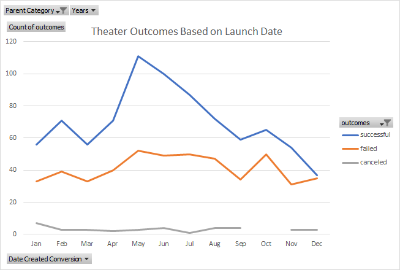
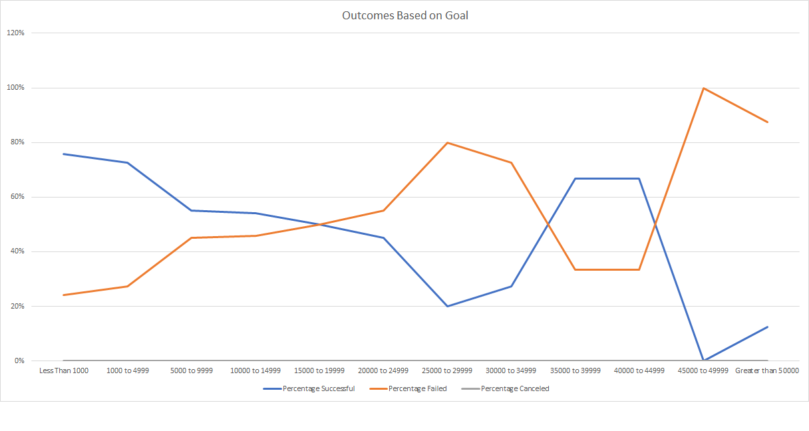

# An Analysis of Kickstarter Campaigns
Kickstarter data analysis in order to determine trends in theater crowdfunded projects

## Overview of Project

### Purpose
The pupose of this analysis is to assess crowdfunding data in order to determine what types of theater projects were successful in reaching their goals.  In this analysis, we will look at project launch dates and project funding goals in order to determine if the timing of the crowdfunding campaign and the monetary goal had any impact on the success of the campaign. This data analysis will be a useful resource to anyone considering a theater crowdfunding campaign. 

## Analysis and Challenges

### Analysis of Outcomes Based on Launch Date
The launch date of a theater crowdfunding campaign had a noticable impact on the success of the project. Campaigns that were initiated in the second quarter of the year (Apr-Jun) saw the highest rates of performance with an average success rate of 65%.  Within the second quarter, the most successful month was June, with a success rate of 67%. Converseley, campaigns that were started in the last quarter of the year (Oct-Dec) only had an average success rate of 56%.  December was notably the least favorable month to start a campaign in, with a success rate of 49%.  Campaigns in both the first and third quarters of the year had success rates of 61%.  The below chart demonstrates the seasonal impact of the success of the timing of theater crowdfunding campaigns with peaks in the springtime and early summer and dropoffs in the winter months. 

### Analysis of Outcomes Based on Goals
The funding goal of a theater campaign impacted the overall success rate.  In general, lower funding goals cooresponded with higher rates of successful campaigns. Notably, campaigns under $5,000 had acceptional performance with an average success rate of 68%. Once campaign goals reached $20,000 the rate of failure exceeded the rate of success (with a few exceptions).  These exceptions fell within the funding goal bracket of $35,000 - $49,999 and will be discussed in the limitations section below.  Overall, the average failure rate of a campaign over $20,000 was 66%. The below graph shows the coorelation between the funding goal set and the success of a theater campaign. 

### Challenges and Difficulties Encountered
No major challenges were encountered during the analysis of this data.  A potential challenge to consider for further analysis is the lack of detailed datapoints. It would be beneficial if additional information was available on the cities within each of the crowdfunding campaigns. The location is limited to the country in this dataset; different cities within the countries included may have higher success rates in their crowdfunding due to higher popularity of the arts and theater.  Additionally, another potential challenge of this dataset is that there a different currencies included that may slightly skew the data results, depending on how different the exchange rates are.     

## Results
In conclusion, the analysis above shows several factors to consider in order to acheive a successful theater crowdfunding campaign.  One important factor is the timing of the launch of the campaign.  To increase chances of success, a recommendation would be to start your campaign in the second quarter of the year (Apr-Jun), preferably in June, the month with the highest rate of campaign successes.  A second recommendation, would be to avoid initiating a theater campaign in the last quarter of the year (Oct-Dec) as these months saw the lowest rates of success.  

In addition to considering the timing of your theater campaign, the funding goal set can also impact the success of the campaign.  Consider creating a campaign below $5,000 for the highest chance of success.  

### Limitations of the dataset
In any set of data there will be limitations.  We encountered limitations in our analysis above regarding the outcomes based on goals.  We noted, in general, once a campaign goal reaches $20,000 the rate of failure exceeds the rate of success; however, there were exceptions noted in the $35,000 - $49,999 goal bracket.  We noted in this bracket, there were nine projects, six of which succeeded. Since, there were a low number of projects in this goal bracket, it is possible there was not enough data to draw broad conclusions.  It is possible these campaigns were likely to succeed, based on other factors not captured in the dataset, such as the impact of good marketing, or how well networked the campaign manager is in the community.  

In addition to the analysis above, we could expand upon this by looking at the lifespan of the theater campaigns to determine if campaigns that were open for a shorter or longer time had a coorelation with their success.  We could demonstrate the trends related to lifespan of a campaign in a bar graph that would show the length of the campaign relative to the success of the campaign.  
